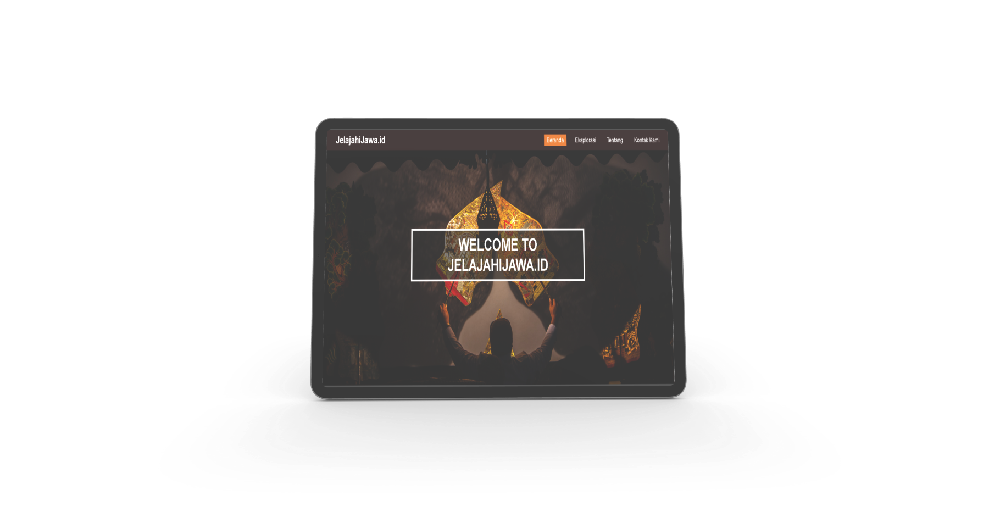

### Captone Project Team C624-PS025

Website JelajahiJawa.id - Kaleidoskop Kebudayaan Jawa
# Pendahulan
  
Situs web JelajahiJawa.id adalah platform online yang berfokus pada penyediaan informasi komprehensif  mengenai ada istiadat, tradisi, bahasa, dan nilai-nilai budaya dapat ditemukan di pulau Jawa, Indonesia. Situs ini dirancang untuk membantu masyarakat dalam mengakses informasi kebudayaan jawa dan melesteraikan budaya jawa.
## Fitur Utama
1. 	Beranda:  Terdapat menu navigasi utama yang memudahkan pengguna untuk mengakses konten tentang kebudayaan jawa.
2. 	Eksplorasi: Bagian Eksplorasi di JelajahiJawa.id dirancang untuk membantu pengguna mengenal lebih dekat setiap provinsi yang ada di pulau Jawa. Di sini, Anda akan menemukan peta interaktif yang menampilkan enam provinsi di pulau Jawa, yaitu Banten, Jawa Timur, Jawa Barat, Jawa Tengah, DKI Jakarta, dan DI Yogyakarta.
3. Tentang: Bagian ini memberikan informasi tentang tim kami di balik JelajahiJawa.id, termasuk visi dan misi dalam membangun situs web ini. Pengguna dapat mengenal lebih dekat orang-orang yang berkontribusi dalam menyediakan konten berkualitas dan menarik tentang Pulau Jawa.
4. Kontak: Kami di JelajahiJawa.id sangat menghargai masukan dan saran dari pengguna untuk memperkaya konten kami, khususnya terkait kebudayaan Jawa. Jika Anda memiliki informasi, saran, atau kritik yang ingin disampaikan.   Silakan ikuti langkah-langkah berikut: 
   * Lengkapi Informasi: Isi semua kolom yang diperlukan di dalam formulir, termasuk nama dan pesan Anda.
   *  Kirim Pesan: Setelah mengisi formulir, klik tombol "Kirim". Pesan Anda akan langsung terkirim ke WhatsApp tim kami, dan kami akan menindaklanjuti secepat mungkin.

## Teknologi yang digunakan
1. Frontend
   - HTML: Digunakan untuk membangun struktur dasar halaman, termasuk header, footer, artikel, dan elemen navigasi.
   - CSS: Digunakan untuk styling visual seperti warna tema situs, font yang digunakan, dan tata letak halaman.
   - Javascript: Digunakan untuk fitur interaktif seperti slider gambar, validasi formulir kontak, dan pemuatan konten dinamis.
3. Framework
   -  Boostrap: Digunakan untuk mempercepat pengembangan front-end dengan komponen UI siap pakai dan sistem grid responsif, sehingga situs terlihat konsisten dan dapat diakses dengan baik di berbagai perangkat.

## Cara Mengakses
- Untuk mengakses situs JelajahiJawa.id, pengguna dapat membuka browser web dan memasukkan URL [kunjungi](https://jelajahijawa.000webhostapp.com/index.html) Pastikan koneksi internet stabil untuk pengalaman browsing yang optimal.
- Gunakan menu navigasi di bagian atas halaman untuk berpindah antara bagian utama seperti eksplorasi, kontak dan tentang.
- Gunakan tombol lihat detail untuk melihat lebih lanjut informasi tentang kebudayaan sebuah provinsi.
